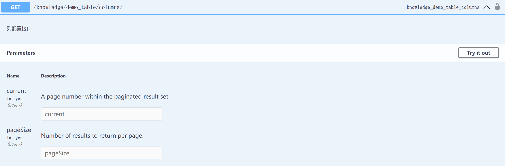

# Automates DRF APIs for Ant Design ProTable

> `drf_antd_protable` automates DRF APIs for Ant Design ProTable, enabling seamless data handling with pagination, sorting, filtering, and searching support, while automatically generating frontend table configurations.

## Installation
```bash
python3 -m pip install -U drf-antd-protable
```

## Usage

1. use in `viewsets`

```python
# views.py
from drf_antd_protable.viewsets import ProTableViewSet
from . import models, serializers

class MyTableViewSet(ProTableViewSet):
    queryset = models.QA.objects.all()
    serializer_class = serializers.QA_Serializer
```

```python
# urls.py
from rest_framework.routers import DefaultRouter
from .views import MyTableViewSet

router = DefaultRouter()
router.register('demo_table', MyTableViewSet, basename='demo_table')

urlpatterns = [
    # ...
    path('', include(router.urls)),
    # ...
]
```

## Endpoints

- `demo_table/columns/`


- `demo_table/data/`


- `demo_table/export/`


## Use in Frontend
```tsx
import { ProTable } from '@ant-design/pro-components'
import { useRequest } from 'ahooks'

const DemoTable = () => {
    const columnsRequest = useRequest(async () => {
        const data = await fetch('/api/demo_table/columns/')
        return data
    })
    return (
        <ProTable
            columns={columnsRequest.data}
            request={async (params, sort, filter) => {
                const { current, pageSize, keyword, ...search } = params;
                const apiParams = {
                    sort: sort,
                    filter: filterWithoutNull,
                    search: search,
                    globalSearch: keyword,
                };
                const data = await fetch('/api/demo_table/data/', {
                    method: 'POST',
                    data: apiParams,
                    params: {current, pageSize},
                })
                return data
            }}
        />
    );
}

```